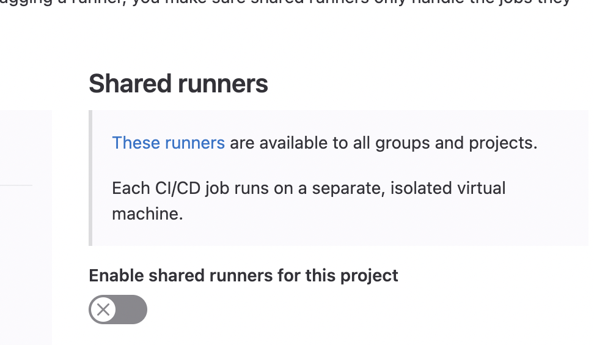

Recently I've become aware of new disruption which is occurring in computing hardware.
ARM based architectures are exploding in adoption and becoming more mainstream.
This change in CPU architectures brings advantages in energy efficiency and when it comes to
cloud computing, cost reduction.

Slowly over the course of the past few weeks I've been adapting my build pipelines to support
multi architecture builds. The thought was that I wanted to continue supporting Intel-based CPU
architecture, but I wanted to add support for ARM and ARM64 architectures.
What I quickly began to find out is that supporting multi-architecture Docker builds comes at a
pretty significant cost in supporting the CI pipelines. Suddenly I was receiving emails from
GitLab informing me that my builds were timing out after running for over an hour.

# Pipeline Runners

Since GitLab is an open-source platform, GitLab enables users to provide their own compute resources
to run builds in addition to the shared runners which are already provisioned for GitLab.com.
With a hosted runner, I can allocate more resources than I would have at my disposal using one of
the many shared runners. Since I already had a Kubernetes cluster running locally, I built an Ansible
playbook so that I could deploy the runner to my local cluster using the
[GitLab Runner Helm Chart](https://docs.gitlab.com/runner/install/kubernetes.html)

## Getting Your Runner Token

When you create a repository, GitLab provides you with a token to register runners to your project.
This token ensures that only your CI jobs run on your runners. You can access your token from
**Settings > CI/CD > Runners**.

## Setting Ansible Variables

With the token in mind, the other information which is required by the Helm chart is the URL for
your GitLab sever. Bear in mind that GitLab can be a hosted service which you keep on your internal
network, it may also be cloud hosted, but for the sake of this tutorial, I will be using https://gitlab.com
as my GitLab URL.

At the beginning of our `playbook.yml` I set the following `vars` block:

```yml
  vars:
    gitlab_token: # Token to connect to the GitLab server -- this is provided when you run the playbook
    gitlab_server: https://gitlab.com
```

## Securing Your Token

While the Helm chart does have a variable to pass in the token, as a general rule of thumb I prefer to store
sensitive information in [Kubernetes Secrets](https://kubernetes.io/docs/concepts/configuration/secret/).

We create a secret in Kubernetes using the following Ansible task:
```yml
  - name: Deploy Runner connection Token
    kubernetes.core.k8s:
      state: present
      definition:
        apiVersion: v1
        kind: Secret
        metadata:
          name: gitlab-runner-token
          namespace: gitlab
        data:
          runner-registration-token: "{{ gitlab_token | b64encode }}"
          runner-token:
```

`b64encode` is an in-line function within ansible which base64 encodes the values passed into it.
Secrets in Kubernetes can never be stored in plaintext and are required to be base64 encoded.

## Deploying the Helm Release

With our runner registration token deployed in our Kubernetes environment, we'll be able to install
the Helm release into our `gitlab` namespace.

```yml
  - name: Deploy GitLab Runner
    kubernetes.core.helm:
      release_name: ci-runner
      chart_ref: gitlab-runner
      chart_repo_url: https://charts.gitlab.io
      release_namespace: gitlab
      release_values:
        gitlabUrl: "{{ gitlab_server }}"
        rbac:
          create: true
        runners:
          secret: gitlab-runner-token
          config: |
            [[runners]]
              [runners.kubernetes]
                privileged=true
                image="docker:20-dind"
              [[runners.kubernetes.volumes.host_path]]
                name="docker"
                read_only=true
                mount_path="/var/run/docker.sock"
                host_path="/var/run/docker.sock"
```

This Helm configuration indicates to use the `gitlab_server` variable set in the `vars` section.
The runner will also be configured to register using the secret `gitlab-runner-token` which contains
the GitLab runner token set in the Ansible variable `gitlab_token` which we will pass in as a command-line
option when we run `ansible-playbook`.

A section of particular note is the configuration provided by the `config` section of the `release_values`.
The configuration provided in `config` instructs the gitlab runner to run as a privileged pod in Kubernetes.
The elevated privileges are required to allow the pod to run as Docker-in-Docker (DinD).
I use dind to run integration tests with testcontainers as well as the multi-arch Docker builds mentioned in the
introduction.

The Ansible play is detailed in the full snippet below:


```yml
  vars:
    gitlab_token: # Token to connect to the Gitlab server
    gitlab_server: https://gitlab.com
  tasks:
    - name: Ensure namespace exists
      kubernetes.core.k8s:
        state: present
        definition:
          apiVersion: v1
          kind: Namespace
          metadata:
            name: gitlab
    - name: Deploy Runner conneciton Token
      kubernetes.core.k8s:
        state: present
        definition:
          apiVersion: v1
          kind: Secret
          metadata:
            name: pantry-runner-token
            namespace: gitlab
          data:
            runner-registration-token: "{{ gitlab_token | b64encode }}"
            runner-token: ""
    - name: Deploy GitLab
      kubernetes.core.helm:
        release_name: pantry
        chart_ref: gitlab-runner
        chart_repo_url: https://charts.gitlab.io
        release_namespace: gitlab
        release_values:
          gitlabUrl: "{{ gitlab_server }}"
          rbac:
            create: true
          runners:
            secret: pantry-runner-token
            config: |
              [[runners]]
                [runners.kubernetes]
                  privileged=true
                  image="docker:20-dind"
                [[runners.kubernetes.volumes.host_path]]
                  name="docker"
                  mount_path="/var/run/docker.sock"
                  host_path="/var/run/docker.sock"
                  read_only=true
```

In my version of the Ansible playbook, I have it hard-coded to run on `localhost` since I only
want to deploy the Helm Release to my local Kubernetes cluster. I deploy the playbook with the
following command:

```bash
ansible-playbook -e gitlab_token="<your-gitlab-token-here>" gitlab.yml
```

# Project Configuration

To run jobs using your registered runners, the most reliable way is to disable shared runners.
In **Settings > CI/CD > Runners** you may find the disable toggle:



I'm able to run my CI/CD pipeline with the dind service in `.gitlab-ci.yml`.

```yml
services:
  - name: docker:dind
    command:
      - "--tls=false"
```

Setting `--tls=false` is a fix for Testcontainers. Newer versions of Docker starting with 20 induce
a delayed start-up time which will cause Testcontainers to fail to initialize.

For my job which runs Testcontainers, I'm able to run using my local runner in the following configuration.
The provided example is for Golang

```yml
go-test:
  variables:
    DOCKER_TLS_CERTDIR: ""
    DOCKER_DRIVER: overlay2
    CGO_ENABLED: "1"
    GO111MODULE: on
  image: golang:1.19-buster
  stage: test
  before_script:
    - apt-get update
    - DEBIAN_FRONTEND=noninteractive apt-get install make git ca-certificates
    - update-ca-certificates
  script:
    - make integration
    - make build
```

The Testcontainers instructions mention to add a variable `DOCKER_HOST: tcp://docker:2375` to the `variables` section.
I omitted this variable due to leaving it in caused the Testcontainers tests to fail with a TCP timeout due to being unable
to find the docker socket. I believe this has largely to do with the docker socket on my local runners being provided by the default
path `/var/run/docker.sock` instead of being accessible through TCP socket.

I set up my multi-arch Docker build with the following CI job:

```yml
docker-build:
  # Use the official docker image.
  image: docker:latest
  stage: release
  before_script:
    - echo $CI_REGISTRY_PASSWORD | docker login -u $CI_REGISTRY_USER --password-stdin
  # Default branch leaves tag empty (= latest tag)
  # All other branches are tagged with the escaped branch name (commit ref slug)
  script:
    - |
      if [[ "$CI_COMMIT_BRANCH" == "$CI_DEFAULT_BRANCH" ]]; then
        tag=""
        echo "Running on default branch '$CI_DEFAULT_BRANCH': tag = 'latest'"
      else
        tag=":$CI_COMMIT_REF_SLUG"
        echo "Running on branch '$CI_COMMIT_BRANCH': tag = $tag"
      fi
    - docker buildx create --use
    - >
        docker buildx build --push 
        --platform linux/arm/v7,linux/arm64/v8,linux/amd64 
        --tag ${CI_REGISTRY_IMAGE}${tag}
```
