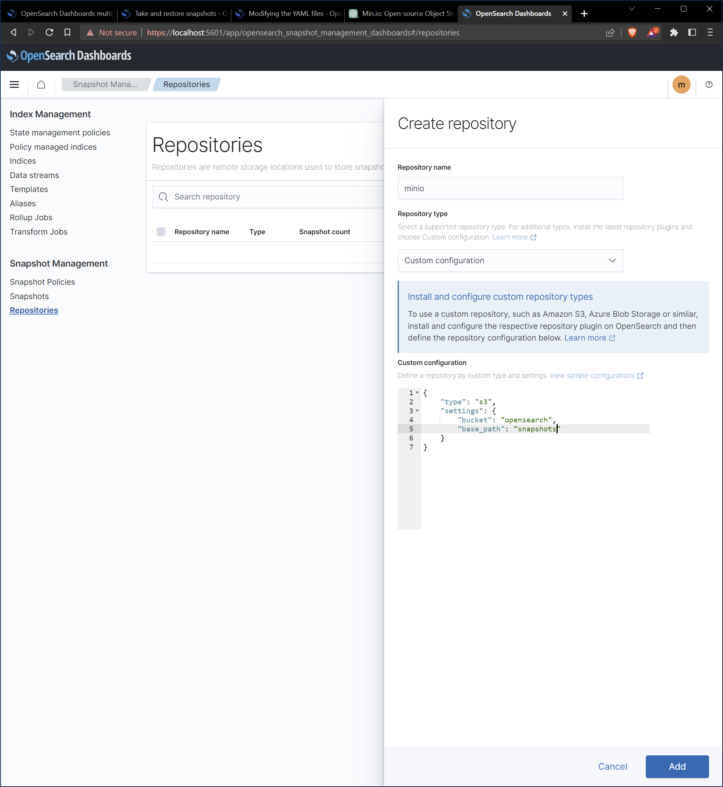

Retaining data is a critical responsibility for any business that stores and manages customer information. Data loss or corruption can arise from various factors, including hardware failures and human errors. The risks associated with data loss can be mitigated by implementing regular backups. OpenSearch, similar to many other databases, manages backups through the use of snapshots. By leveraging snapshots, OpenSearch can create secure point-in-time copies of data.

In our setup, we will utilize Min.io as an interface for OpenSearch to connect to storage. Additionally, we will establish a snapshot repository to facilitate backups.

## Installing Min.io

Min.io is a file storage server that exposes files as HTTP URLs using the REST protocol. The service is cloud-native and can be deployed on various service providers, such as Docker, Kubernetes, OpenShift, EKS, and GCP. It can be scaled to ensure high availability and fault tolerance, which is crucial for OpenSearch to have reliable access to its snapshots and backups. Additionally, Min.io supports the Amazon AWS S3 access protocols, allowing for secure file storage with fine-grained access controls.

OpenSearch has [native support](https://opensearch.org/docs/latest/tuning-your-cluster/availability-and-recovery/snapshots/snapshot-restore/#amazon-s3) for taking snapshots leveragingthe S3 protocol.

We will be deploying Min.io onto Kubernetes using the Helm chart.
The Helm chart will be deployed using an Ansible playbook.
To avoid the tutorial becoming to lengthy, high-availablilty configurations
will be left out. Min.io will be a standalone single-node cluster.

```yml
- name: Deploy Min.io
  kubernetes.core.heml:
    release_name: storage
    release_namespace: opensearch
    chart_ref: minio
    chart_repo_url: https://charts.min.io
    wait: true
    values:
      root_user: "{{ minio_user }}"
      root_password: "{{ minio_password }}"
      replicas: 1
      mode: standalone
      persistance:
        enabled: false
      resources:
        requests:
          memory: 512mi
      buckets:
        - name: opensearch
          policy: none
          purge: false
      svcaccts:
        - accessKey: opensearch
          secretKey: "{{ opensearch_secret_key }}"
          user: console
          policy:
            statements:
              - resources:
                  - arn:aws:::opensearch/*
                actions:
                  - s3:GetObject
                  - s3:PutObject
                  - s3:DeleteObject
              - resources:
                  - arn:aws:::opensearch
                actions:
                  - s3:ListBucket
```

The Ansible playbook creates a single-node Min.io server, which is suitable for local development purposes such as a test lab environment. The Helm chart provisions a bucket called `opensearch`. This `opensearch` bucket will serve as the storage location for our OpenSearch snapshots.

The Helm chart also deploys a service account called `opensearch`. This `opensearch` service account will be utilized by the OpenSearch service to log into Min.io using the generated access key and secret key. Min.io will leverage the `opensearch` service account to control access to the `opensearch` bucket, allowing only the actions specified in the policy to be performed by the service account.

The `opensearch` service account has the ability to utilize `ListBucket` to discover the opensearch bucket. Additionally, it can create and update objects on the bucket using `PutObject`, retrieve objects from the bucket using `GetObject`, and delete items from the bucket using `DeleteObject`.

In the next section we will be setting up a Helm chart through Ansible to provision the OpenSearch cluster.

## Installing OpenSearch

Before we can set up our OpenSearch cluster, we need to store our Min.io credentials into a secret so that they may be consumed by the Helm chart and provided in the OpenSearch configuration when the OpenSearch cluster gets provisioned.

```yml
- name: Deploy OpenSearch Minio Secrets
  kubernetes.core.k8s:
    state: present
    definition:
      apiVersion: v1
      kind: Secret
      metadata:
        name: opensearch-storage-secrets
        namespace: opensearch
      data:
        s3.client.default.access_key: "{{ 'opensearch' | b64encode }}"
        s3.client.default.secret_key: "{{ opensearch_secret_key | b64encode}}
```

With the secret set up, we deploy the OpenSearch cluster:

```yml
- name: Deploy OpenSearch Cluster
  kubernetes.core.helm:
    release_name: index
    release_namespace: opensearch
    chart_ref: opensearch
    chart_repo_url: https://opensearch-project.github.io/helm-charts
    values:
      replicas: 1
      minimumMasterNodes: 0
      config:
        opensearch.yml: |
          s3.client.default:
            endpoint: "http://storage-minio.opensearch:9000
            protocol: http
            path_style_access: true
      keystore:
        - secretName: opensearch-storage-secrets
      plugins:
        enabled: true
        installList: ["repository-s3"]
```

> ⚠️ Sections of the configuration have been omitted.
> The ommision is to highlight the configurations which
> are specific to configuring OpenSearch to work with Min.io
> For a full configuration reference, please consult
> [The Helm chart values](https://github.com/opensearch-project/helm-charts/blob/main/charts/opensearch/values.yaml)
> and the [opensearch.yml values](https://opensearch.org/docs/latest/security/configuration/yaml/#opensearchyml).

The Ansible play mentioned above provisions a single-node OpenSearch cluster. The `opensearch.yml` configuration section corresponds to the primary configuration file for OpenSearch, also known as `opensearch.yml`. The s3.client.default configuration sets up the default S3 client, which will be utilized to establish a connection with Min.io.

The `keystore` section connects to the Kubernetes Secret that was created earlier. The keystore details include the access key and secret key, which are used to pass credentials to Min.io.

The `plugins` section instructs the OpenSearch Helm chart to install the `repository-s3` plugin

## Setting up the Snapshot Repository

With OpenSearch deployed, the configuration of the snapshot repository can be initiated. An OpenSearch snapshot repository serves as a mechanism to store and manage backups (snapshots) of an OpenSearch cluster's data and configuration. Snapshots are crucial for capturing the data stored within OpenSearch indices, enabling point-in-time recovery and restoration in the event of system failures or data loss scenarios.

To set up a snapshot repository, we will have to port-forward our OpenSearch Dashboards service.

```bash
kubectl port-forward -n opensearch services/index-ui-opensearch-dashboards 5601:5601
```

OpenSearch Dashboards will be accessible at `https://localhost:5601`.

OpenSearch 2.x introduces a snapshot management dashboard which can be accessible through the hamburger menu at the top right and then click **snapshot management**.
Click on **Repositories** from the sidebar menu.
There will be a **Create repository** button which can be used to create a new snapshot repository.
We will create a repository with the following information:

- **Repository Name**: minio
- **Repository Type**: Custom configuration

Under **Custom configuration** we will enter the following JSON string:

```json
{
    "type": "s3",
    "settings": {
        "bucket": "opensearch",
        "base_path": "snapshots"
    }
}
```

Click **Add**. The snapshot repository will be created.



Now that the snapshot repository is created, you should be able to create snapshots.

For the case of our example, I've created a snapshot of the `.opendistro_security` index.


With the snapshot created, the snapshot will be visible from the Min.io console


## Improving the Deployment for Production Readiness

The installation procedure described in the previous sections outlined how to set up Min.io and OpenSearch for snapshot backups using the S3 plugin. To make the installation production-ready, several enhancements can be implemented:

- Enable network-based persistence volume (e.g., NFS) for the Min.io deployment.
- Scale up Min.io to a multi-node cluster configuration.
- Generate server keys for Min.io to encrypt objects at rest.
- Enable SSL configuration for Min.io.
- Configure a snapshot policy in OpenSearch to capture snapshots at regular intervals.
- Install service monitors to regularly send usage metrics to a data store (e.g., Prometheus).

## References

- [Min.io helm chart](https://github.com/minio/minio/tree/master/helm/minio)
- [OpenSearch helm chart](https://github.com/opensearch-project/helm-charts/tree/main/charts/opensearch)
- [OpenSearch S3 Snapshot docs](https://opensearch.org/docs/latest/tuning-your-cluster/availability-and-recovery/snapshots/snapshot-restore/#amazon-s3)
- [Opensearch YAML Configuration](https://opensearch.org/docs/latest/security/configuration/yaml/#opensearchyml)
