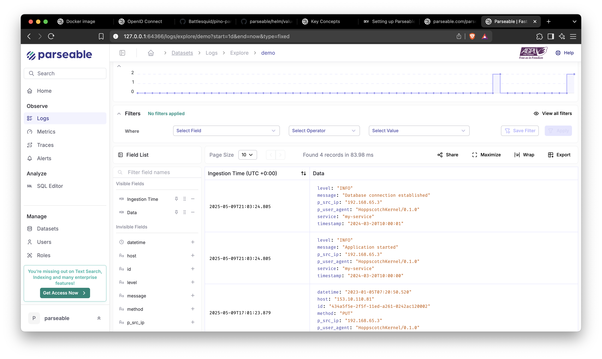

# Setting up Parseable with Kubernetes and Docker Desktop

This guide will walk you through setting up Parseable, a modern log analytics platform, using Kubernetes on Docker Desktop. We'll cover the complete setup process including MinIO for storage, Parseable deployment using Helm, and configuring ingress for external access.

## Prerequisites

Before we begin, ensure you have the following prerequisites installed and configured:

- Docker Desktop with Kubernetes enabled
- [Ingress-NGINX controller](https://kubernetes.github.io/ingress-nginx/deploy/) deployed on your Kubernetes cluster
- `kubectl` configured to work with your Docker Desktop Kubernetes cluster
- Ansible configured to run playbooks

## Table of Contents

1. [Setting up MinIO](#setting-up-minio)
2. [Deploying Parseable using Helm](#deploying-parseable)
3. [Configuring Ingress](#configuring-ingress)
4. [Complete Ansible Playbook](#complete-ansible-playbook)

## Setting up MinIO

MinIO is an object storage system that Parseable uses for storing logs. Let's set it up first.

### Deploying MinIO

We'll use Helm to deploy MinIO with some basic configuration. This setup creates a MinIO instance with a root user (minioadmin), configures a 10GB persistent volume for storage, and creates a bucket named "parseable". Additionally, we set up a service account with specific permissions - the account has access keys configured and is granted permissions to perform read, write and delete operations on objects within the parseable bucket, as well as list the bucket contents. This configuration ensures Parseable will have the necessary permissions to store and manage logs in MinIO.

```yml
- name: Deploy MinIO using Helm
    kubernetes.core.helm:
    release_name: minio
    release_namespace: minio
    chart_ref: minio
    chart_repo_url: https://charts.min.io
    create_namespace: true
    release_values:
        rootUser: minioadmin
        rootPassword: minioadmin
        persistence:
        size: 10Gi
        buckets:
          - name: parseable
            policy: none
            purge: false
        svcaccts:
          - accessKey: parseable
            secretKey: 'parseable'
            user: console
            policy:
            statements:
              - resources:
                  - arn:aws:s3:::parseable/*
                actions:
                  - s3:GetObject
                  - s3:PutObject
                  - s3:DeleteObject
              - resources:
                - arn:aws:s3:::parseable
              actions:
                - s3:ListBucket
```

## Deploying Parseable

Now that we have MinIO set up, let's deploy Parseable using its Helm chart.

### Installing Parseable

The following Ansible code block deploys Parseable using two tasks. The first task creates a Kubernetes Secret containing essential configuration parameters for Parseable, including MinIO connection details (like the service URL, access credentials, and bucket name), network settings, storage directories, and admin authentication credentials. All these values are base64 encoded as required for Kubernetes Secrets. The second task uses Helm to deploy the actual Parseable application, utilizing the official Helm chart from the Parseable repository and configuring it to use S3 (MinIO) as its storage backend.

```yml
- name: Deploy Parseable configuration
    kubernetes.core.k8s:
      state: present
      definition:
        apiVersion: v1
        kind: Secret
        metadata:
          name: parseable-env-secret
          namespace: parseable
        data:
          s3.url: "{{ 'https://minio.minio.svc.cluster.local:9000' | b64encode }}"
          s3.access.key: "{{ 'parseable' | b64encode }}"
          s3.secret.key: "{{ 'parseable' | b64encode }}"
          s3.bucket: "{{ 'parseable' | b64encode }}"
          addr: "{{ '0.0.0.0:8000 | b64encode }}"
          staging.dir: "{{ './staging' | b64encode }}"
          fs.dir: "{{ './data' | b64encode }}"
          username: "{{ 'parseable' | b64encode }}"
          password: "{{ 'parseable' | b64encode }}"
- name: Deploy Parseable helm chart
  kubernetes.core.helm:
    name: parseable
    chart_ref: parseable
    chart_repo_url: https://charts.parseable.com
    release_namespace: parseable
    values:
      parseable:
        store: s3-store
```

## Configuring Ingress

To expose the Parseable ingest API endpoint for log ingestion, we'll create an Ingress resource that routes requests through the /logs path prefix. This approach both limits external access to just the ingest API and avoids CORS issues, while keeping the UI and other endpoints private within the cluster.

### Creating Ingress Resource

```yml
- name: Deploy the Parseable ingress
  kubernetes.core.k8s:
  state: present
  definition:
    apiVersion: networking.k8s.io/v1
    kind: Ingress
    metadata:
      name: parseable-ingress
      namespace: parseable
      annotations:
        kubernetes.io/ingress.class: nginx
        nginx.ingress.kubernetes.io/use-regex: "true"
        nginx.ingress.kubernetes.io/rewrite-target: /api/v1/ingest/$2
    spec:
      rules:
      - host: parseable.local
        http:
          paths:
          - path: /logs/api/v1/ingest(/|$)(.*)
            pathType: ImplementationSpecific
            backend:
              service:
                name: parseable
                port:
                  number: 80
```

## Complete Ansible Playbook

For convenience, here's a complete Ansible playbook that combines all the tasks we've discussed. Create a file named `deploy-parseable.yml` with the following content:

```yaml
---
- name: Deploy Parseable Stack
  hosts: localhost
  connection: local
  tasks:
    - name: Deploy MinIO using Helm
      kubernetes.core.helm:
        release_name: minio
        release_namespace: minio
        chart_ref: minio
        chart_repo_url: https://charts.min.io
        create_namespace: true
        release_values:
          rootUser: minioadmin
          rootPassword: minioadmin
          persistence:
            size: 10Gi
          buckets:
            - name: parseable
              policy: none
              purge: false
          svcaccts:
            - accessKey: parseable
              secretKey: 'parseable'
              user: console
              policy:
                statements:
                  - resources:
                      - arn:aws:s3:::parseable/*
                    actions:
                      - s3:GetObject
                      - s3:PutObject
                      - s3:DeleteObject
                  - resources:
                      - arn:aws:s3:::parseable
                    actions:
                      - s3:ListBucket

    - name: Deploy Parseable configuration
      kubernetes.core.k8s:
        state: present
        definition:
          apiVersion: v1
          kind: Secret
          metadata:
            name: parseable-env-secret
            namespace: parseable
          data:
            s3.url: "{{ 'https://minio.minio.svc.cluster.local:9000' | b64encode }}"
            s3.access.key: "{{ 'parseable' | b64encode }}"
            s3.secret.key: "{{ 'parseable' | b64encode }}"
            s3.bucket: "{{ 'parseable' | b64encode }}"
            addr: "{{ '0.0.0.0:8000' | b64encode }}"
            staging.dir: "{{ './staging' | b64encode }}"
            fs.dir: "{{ './data' | b64encode }}"
            username: "{{ 'parseable' | b64encode }}"
            password: "{{ 'parseable' | b64encode }}"

    - name: Deploy Parseable helm chart
      kubernetes.core.helm:
        name: parseable
        chart_ref: parseable
        chart_repo_url: https://charts.parseable.com
        release_namespace: parseable
        values:
          parseable:
            store: s3-store

    - name: Deploy the Parseable ingress
      kubernetes.core.k8s:
        state: present
        definition:
          apiVersion: networking.k8s.io/v1
          kind: Ingress
          metadata:
            name: parseable-ingress
            namespace: parseable
            annotations:
              kubernetes.io/ingress.class: nginx
              nginx.ingress.kubernetes.io/use-regex: "true"
              nginx.ingress.kubernetes.io/rewrite-target: /api/v1/ingest/$2
          spec:
            rules:
            - host: parseable.local
              http:
                paths:
                - path: /logs/api/v1/ingest(/|$)(.*)
                  pathType: ImplementationSpecific
                  backend:
                    service:
                      name: parseable
                      port:
                        number: 80
```

Run the complete playbook with:
```bash
ansible-playbook deploy-parseable.yml
```

### Accessing Parseable

Once deployed, you can access the Parseable UI by setting up port forwarding from your local machine to the Parseable service in the cluster. Run the following command to forward port 8000 on your local machine to port 80 of the Parseable service:

```bash
kubectl port-forward -n parseable svc/parseable 8000:80
```

You can now send logs to Parseable by making POST requests to the ingress endpoint at `host.docker.internal/logs/api/v1/ingest`. Here's an example curl command that demonstrates how to send logs:

```bash
curl -X POST http://host.docker.internal/logs/api/v1/ingest \
  -H "Content-Type: application/json" \
  -H "X-P-Stream: my-logs" \
  -H "Authorization: Basic $(echo -n 'parseable:parseable' | base64)" \
  -d '{
    "timestamp": "2024-03-20T10:00:00Z",
    "level": "INFO",
    "message": "Application started",
    "service": "my-service",
    "environment": "development"
  }'
```

In this example:
- `X-P-Stream` header specifies the log stream name
- `Authorization` header contains the base64-encoded credentials (username:password)
- The JSON payload contains structured log data with:
  - `timestamp`: ISO 8601 formatted timestamp
  - `level`: Log level (INFO, ERROR, etc.)
  - `message`: The actual log message
  - Additional fields for context (service, environment, etc.)

You can send multiple log entries in a single request by using an array:

```bash
curl -X POST http://host.docker.internal/logs/api/v1/ingest \
  -H "Content-Type: application/json" \
  -H "X-P-Stream: my-logs" \
  -H "Authorization: Basic $(echo -n 'parseable:parseable' | base64)" \
  -d '[
    {
      "timestamp": "2024-03-20T10:00:00Z",
      "level": "INFO",
      "message": "Application started",
      "service": "my-service"
    },
    {
      "timestamp": "2024-03-20T10:00:01Z",
      "level": "INFO",
      "message": "Database connection established",
      "service": "my-service"
    }
  ]'
```

After sending some sample logs, you can view them in the Parseable UI by accessing `localhost:8000` in your browser:



## Next Steps

- Configure log shipping from your applications
- Set up log retention policies
- Create dashboards and alerts

## Troubleshooting

If you encounter any issues during the setup, check the following:

1. Verify all pods are running:
```bash
kubectl get pods -A
```

2. Check MinIO logs:
```bash
kubectl logs -n minio -l app=minio
```

3. Check Parseable logs:
```bash
kubectl logs -l app.kubernetes.io/name=parseable
```

## Conclusion

You now have a fully functional Parseable instance running on your local Kubernetes cluster. This setup provides a solid foundation for log analytics and monitoring in your development environment.

